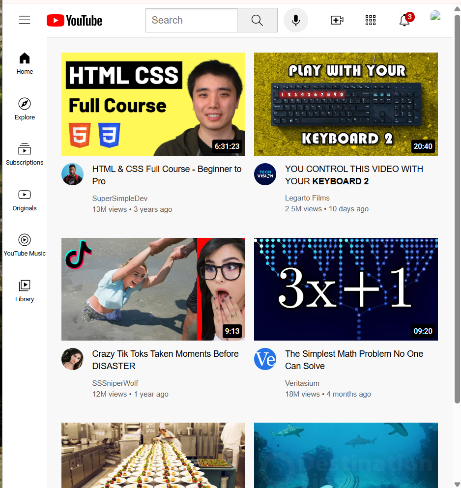
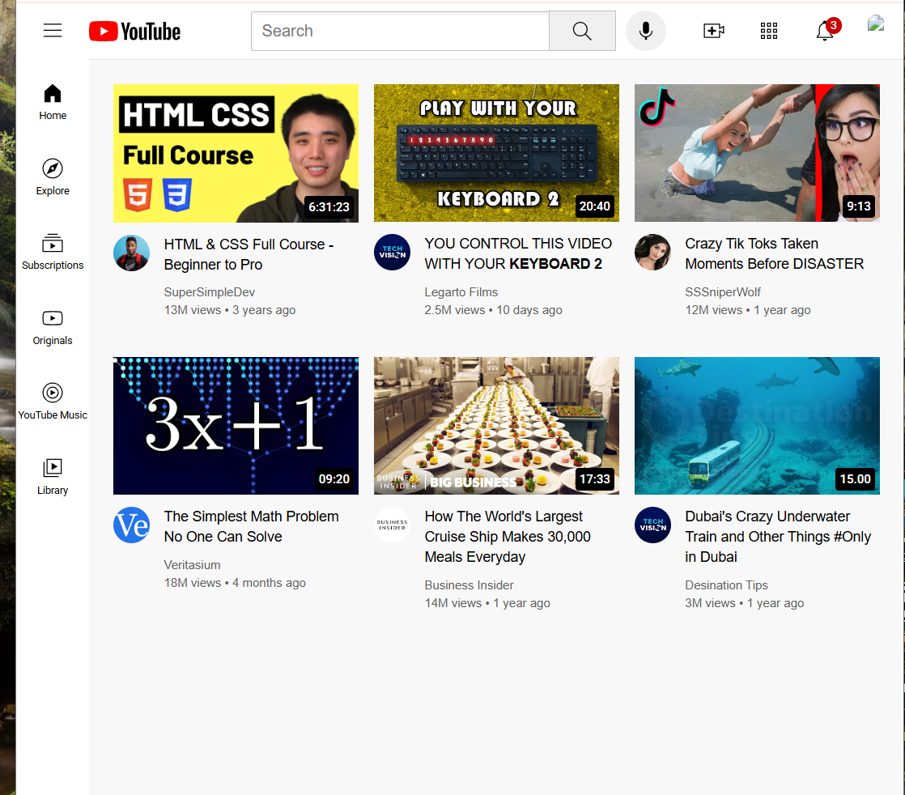

# practice-youtube-clone
# 🎥 YouTube Clone

A simple **YouTube Clone** built using **HTML and CSS only**.  
This project was created to practice frontend web development and layout design using Flexbox and Grid.  

---

## 📸 Screenshots
Homepage Preview:  

---

## 🚀 Features
- Responsive **navigation bar** with SVG icons  
- **Sidebar menu** for navigation  
- **Video grid layout** for displaying content  
- Clean UI inspired by YouTube  

---

## 🛠️ Tech Stack
- **HTML5** → Structure of the page  
- **CSS3 (Flexbox & Grid)** → Layout and styling  
- **SVG Assets** → Lightweight icons  

---

## 📚 What I Learned
- Structuring complex web pages with **HTML5**  
- Styling and layouts with **CSS Grid and Flexbox**  
- Managing **SVG assets** for icons and logos  
- Maintaining a neat folder structure for projects  

---

